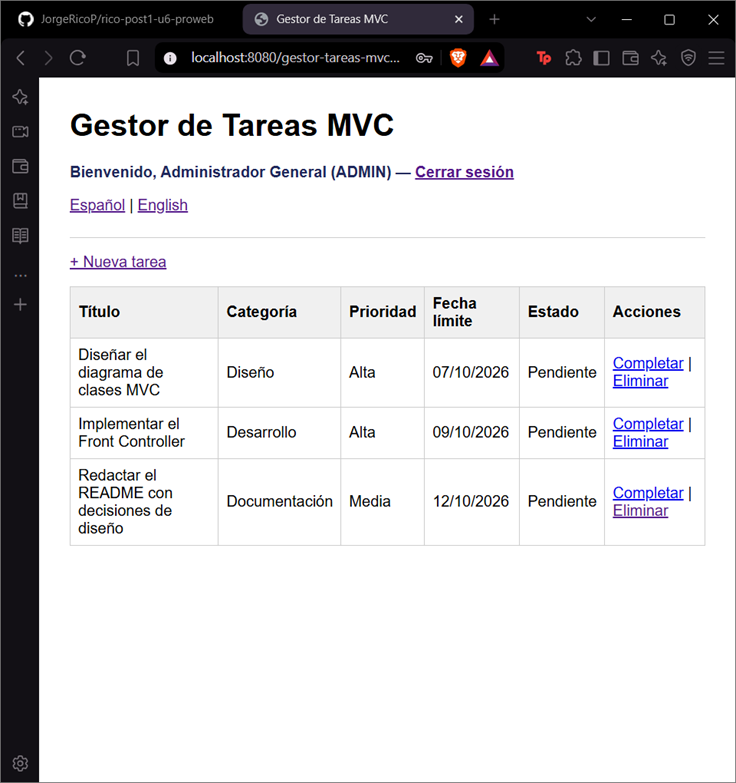
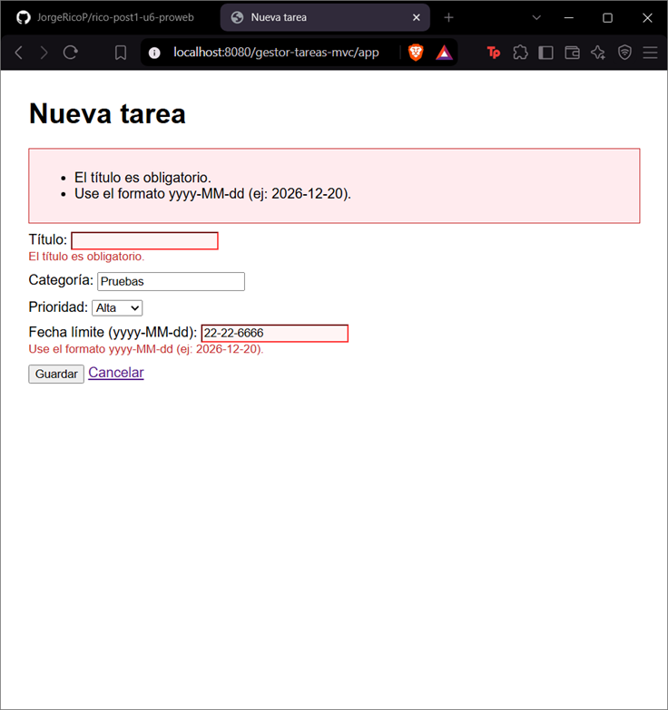
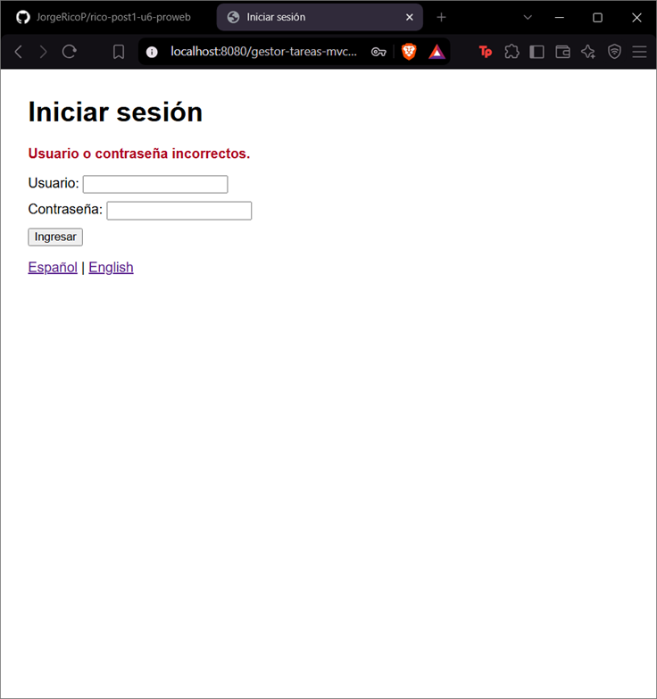
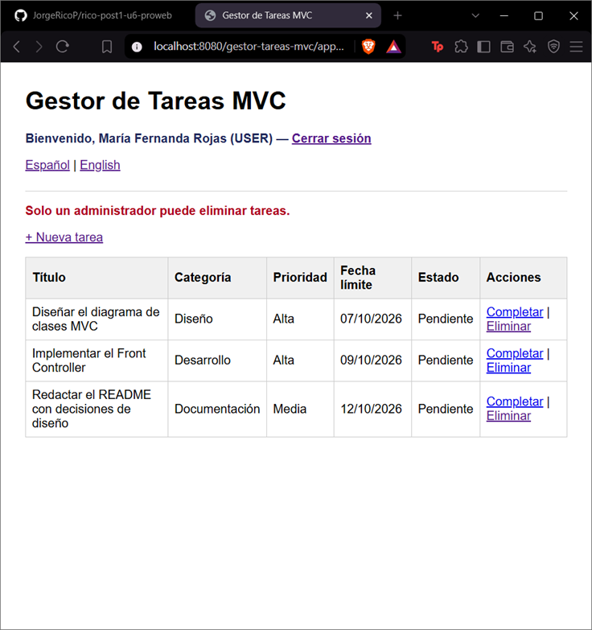
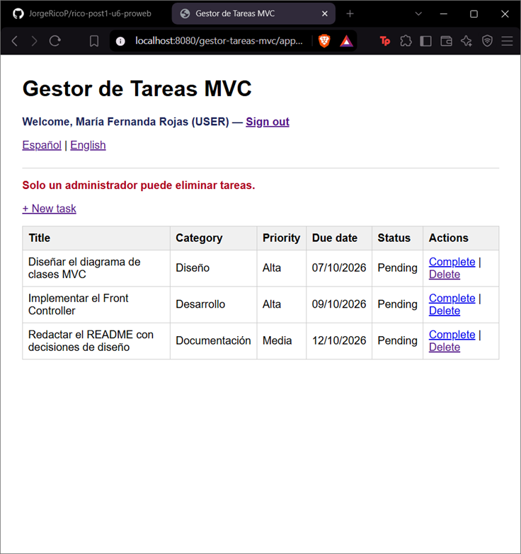

# Post-contenido — Unidad 6: JSP con MVC

**Autor:** Jorge Rico

## Descripción
Repositorio del laboratorio de la Unidad 6 de Programación Web — Séptimo
Semestre. Contiene un único proyecto Maven Web (gestor-tareas-mvc) que
formaliza el patrón MVC con un Front Controller y el patrón Comando,
extendido con autenticación por sesión con roles, validación por campo
e internacionalización.

## Parte 1 — Front Controller y patrón Comando
FrontControllerServlet es el único punto de entrada (/app) y delega en
objetos Comando (ListarComando, FormularioComando, GuardarComando,
EliminarComando, CompletarComando). TareaService y TareaDAO separan la
lógica de negocio y el acceso a datos del Controlador. Las vistas usan
JSTL y Expression Language, sin scriptlets.

## Parte 2 — Sesión con roles, validación por campo e i18n
FrontControllerServlet centraliza la verificación de sesión antes de
resolver cualquier comando protegido. LoginComando/LogoutComando
gestionan HttpSession con roles ADMIN/USER; EliminarComando solo
permite el rol ADMIN. GuardarComando valida cada campo del formulario
por separado, usando el límite de longitud del título leído del
contexto de aplicación (web.xml). IdiomaComando guarda la preferencia
de idioma en una Cookie, leída directamente en las vistas con el
objeto EL implícito cookie y ResourceBundle (messages.properties /
messages_en.properties / messages_es.properties).

## Usuarios de prueba
| Usuario | Contraseña | Rol |
|---|---|---|
| admin | Admin123! | ADMIN |
| maria | Maria2026! | USER |

## Decisiones de diseño
- El Comando devuelve la vista lógica (o null si ya hizo un redirect)
  en vez de invocar el forward directamente, para que
  FrontControllerServlet concentre esa llamada en un solo lugar.
- Se usó un Front Controller en vez de un Servlet por acción para que
  la verificación de sesión de la Parte 2 se agregara una sola vez,
  en procesar(), sin copiarla al inicio de cada Servlet.
- El nombre de usuario y el rol viven en HttpSession porque deben
  expirar con la sesión; el idioma vive en una Cookie porque debe
  sobrevivir al cierre de sesión (Guía, tabla comparativa 5.4).
- La longitud máxima del título de una tarea se lee del contexto de
  aplicación (context-param en web.xml) en vez de codificarse como
  literal en GuardarComando, para poder cambiar la regla sin
  recompilar.

## Cómo compilar y desplegar
1. Clonar el repositorio: `git clone https://github.com/JorgeRicoP/rico-post1-u6-proweb.git`
2. Abrir la carpeta clonada como proyecto Maven en IntelliJ IDEA.
3. Ejecutar `mvn clean package` (genera `target/gestor-tareas-mvc.war`).
4. Desplegar en Apache Tomcat 10.x: con el plugin Smart Tomcat
   (Context Path `/gestor-tareas-mvc`, puerto 8080) o copiando el WAR
   a la carpeta `webapps` de Tomcat.
5. Abrir `http://localhost:8080/gestor-tareas-mvc/app`.

## Capturas de pantalla

